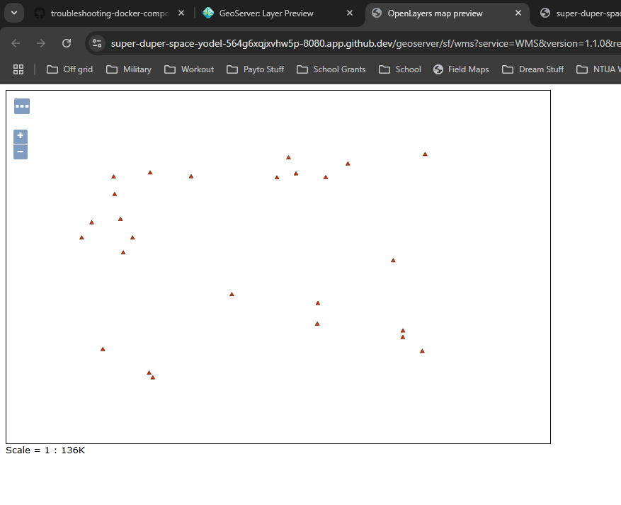
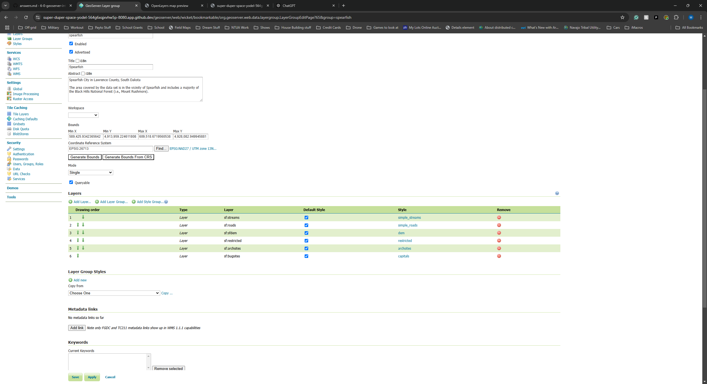

Asnwers to questions in the README.md

#### Q1: What is the URL of the WMS GetCapabilities request?

https://super-duper-space-yodel-564g6xqjxvhw5p-8080.app.github.dev/geoserver/ows?service=WMS&version=1.3.0&request=GetCapabilities

#### Q2: What is the URL of the WFS GetCapabilities request?

https://super-duper-space-yodel-564g6xqjxvhw5p-8080.app.github.dev//geoserver/wfs?request=wfs&version=1.1.0&request=GetCapabilities

#### Q3: Submit a screenshot of your updated WFS Layer Preview

#### Q4: What does drawing order refer to? Which layer goes on `top`, the first or the last layer in the list?

Drawing order determines the sequence in which layers are rendered on the map. This sequence controls which layers appear 'on top' or 'below' others.

#### Q5: Submit a screenshot of the Layer Preview of the Spearfish Layer Group when sf:sfdem is listed as the 3rd layer.

#### Q6: What is the WMS url for the single-tiled request?

https://super-duper-space-yodel-564g6xqjxvhw5p-8080.app.github.dev/geoserver/wms?service=WMS&version=1.1.0&request=GetMap&layers=spearfish&bbox=589425.9342365642%2C4913959.224611808%2C609518.6719560538%2C4928082.949945881&width=768&height=539&srs=EPSG%3A26713&styles=&format=application/openlayers#toggle

#### Q7: What is the WMS url for one of the tiled requests? What is the image size?

https://super-duper-space-yodel-564g6xqjxvhw5p-8080.app.github.dev/geoserver/wms?SERVICE=WMS&VERSION=1.1.1&REQUEST=GetMap&FORMAT=image%2Fpng&TRANSPARENT=true&tiled=true&STYLES&LAYERS=spearfish&exceptions=application%2Fvnd.ogc.se_inimage&tilesOrigin=589425.9342365642%2C4913959.224611808&WIDTH=256&HEIGHT=256&SRS=EPSG%3A26713&BBOX=598595.4536077194%2C4920698.953330398%2C599817.076982429%2C4921920.576705107

Has a of WIDTH: 256 and a of HEIGHT: 256

#### Q8: What is the URL of your coarse resolution sample of a WMTS url? What level does this tile refer to? Notice the differences. What are some of the fields that are unique to this url?

This tile refers to level 11 in the EPSG:4326 tile matrix set. Unique fields in the WMTS URL include TILEMATRIX, which specifies the zoom level; TILEMATRIXSET, which defines the spatial reference system; TileCol and TileRow, which locate the specific tile; and REQUEST=GetFeatureInfo, which requests information about the features in the tile.

#### Q9: In the zoomed-out URL, what are the TileCol and TileRow?

In the zoomed-out URL, the TileCol is 867, and the TileRow is 518.

#### Q10: In the zoomed-in URL, what are the TileCol and TileRow?

In the zoomed-in URL, the TileCol is 13878, and the TileRow is 8294.

#### Q11: Why are they so different for the same location in the map?

The TileCol and TileRow values differ because higher zoom levels divide the map into more tiles. At zoomed-out levels, fewer tiles cover larger areas, while zoomed-in levels require more tiles to show finer details, increasing the tile indices for the same location.

#### Q12: Is there a difference in the TileMatrix? %3A is an HTML encoding for a colon, `:`.What does the number after EPSG:4326 mean?

Yes, there is a difference in the TileMatrix. The number after EPSG:4326 in the TILEMATRIX ,EPSG:4326:11 or EPSG:4326:15, represents the zoom level within the tile matrix set. This number determines the resolution and scale of the tiles, with higher numbers indicating a more detailed zoom level and smaller geographic area per tile.